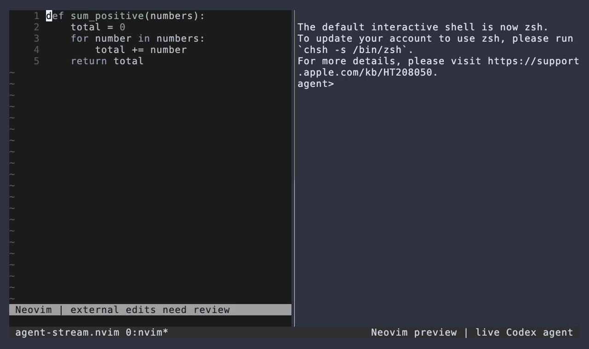

# agent-stream.nvim

[](https://github.com/awill1988/agent-stream.nvim/actions/workflows/ci.yml)
[](doc/development.md#code-review)
[](https://neovim.io)
[](LICENSE)

Review external file edits inside Neovim while your agent keeps working.

`agent-stream.nvim` watches files open in buffers and displays incoming changes as gutter signs and virtual lines. Your buffer stays unchanged until you choose what to keep.

[](demo/showcase.mp4)

**Live tmux demonstration:** Neovim on the left, Codex editing and running tests on the right. The fix is accepted; a later variable rename is rejected. Idle periods are compressed. [Watch the MP4](demo/showcase.mp4).

- **Review in place:** additions and replacements appear beside the current buffer.
- **Keep control:** accept the disk snapshot or restore the buffer version to disk.
- **Follow your theme:** native Neovim highlights, ordinary-text symbols, explicit overrides.
- **Use your workflow:** external editors, agent harnesses, and scripts need no plugin API calls.

## Install

Requires Neovim `0.11.7+`. No companion plugin or special font is required.

With [lazy.nvim](https://github.com/folke/lazy.nvim):

```lua
{
  "awill1988/agent-stream.nvim",
  lazy = false,
  opts = {},
}
```

For other plugin managers, call `require("agent-stream").setup({})` after loading the plugin.

## Review changes

| Command | Result |
| --- | --- |
| `:AgentStreamNextHunk` / `:AgentStreamPrevHunk` | Navigate incoming changes |
| `:AgentStreamAccept` | Replace the buffer with the previewed disk snapshot |
| `:AgentStreamReject` | Write the current buffer contents back to disk |
| `:AgentStreamCancel` | Interrupt the optimistic tmux agent task without reverting accepted edits |
| `:AgentStreamResume` | Send the configured resume instruction to the interrupted tmux agent task |
| `:AgentStreamClear` | Clear preview decorations |
| `:AgentStreamStatus` | Show watcher, diff, and server status |

Accept and reject apply to the **whole file**. Accept replaces local buffer edits; reject writes those edits to disk. Previewing changes does not modify buffer text or undo history.

### Optimistic review

Manual review is the default. To apply clean incoming changes immediately, display a
three-second countdown, and allow task interruption during that window:

```lua
require("agent-stream").setup({
  review = { mode = "optimistic", grace_period_ms = 3000 },
  task_control = require("agent-stream.transports.tmux"),
})
```

Neovim is the only runtime dependency. Set `task_control = "auto"` to enable
the bundled tmux adapter only when Neovim runs inside tmux and tmux is available.
Otherwise review and optimistic acceptance stay Neovim-only. `Cancel`
sends `C-c` only to a verified tmux pane, preserves the accepted file
contents, and leaves `:AgentStreamResume` available. Resume sends a configurable
instruction to the existing terminal process; it cannot recover an exited process.
The compact countdown is available to statusline plugins through
`require("agent-stream").statusline()` and updates the `User`
`AgentStreamStateChanged` event.

While watching a file, the plugin manages its buffer-local `autoread` setting so native reload does not bypass review. It restores the saved setting on detach if the user has not changed it. Global settings and unrelated buffers are preserved. Set `manage_autoread = false` to opt out; `auto_reload_unmodified = true` separately opts into plugin-controlled acceptance for clean buffers.

### Optional shortcuts

No shortcuts are installed by default. Supply only the actions you want:

```lua
require("agent-stream").setup({
  keymaps = {
    accept = "<leader>aa",
    reject = "<leader>ar",
    next_hunk = "]a",
    prev_hunk = "[a",
  },
})
```

Use `keymaps = false` or a per-action `false` to disable mappings. Explicit mappings replace global mappings on the supplied keys. Repeated setup removes only mappings still owned by the plugin.

## Make it yours

```lua
require("agent-stream").setup({
  show_summary = true,
  show_signs = true,
  show_virtual_lines = true,
  sign_priority = 10,
  signs = { add = "+", delete = "-", change = "~" },
  symbols = { badge = "", add = "+", change = ">" },
  highlights = {
    AgentStreamBadge = { link = "DiagnosticHint" },
  },
})
```

Signs inherit `Added`, `Removed`, and `Changed`; previews use `DiffAdd`, `DiffDelete`, and `DiffChange`. Theme switches restore defaults without overwriting theme-defined groups. Each explicit highlight override replaces the complete default definition and is reapplied after theme changes; add `default = true` to defer to an existing theme definition.

Symbols must be empty or occupy at most two display cells. `sign_priority` accepts integers from `0` through `65535`; higher-priority signs win when gutter space is limited. Your `vim.notify` handler and display options remain in use.

Existing users: shortcuts are now opt-in, signs use native highlights instead of requiring Gitsigns, and buffer-local `autoread` is managed by default.

## Integrations

**Neo-tree:** register the badge component in your existing file renderer:

```lua
filesystem = {
  components = {
    agent_stream_badge = require("agent-stream.explorer.neo_tree").component,
  },
  renderers = {
    file = {
      { "icon" },
      { "name", use_git_status_colors = true },
      { "agent_stream_badge" },
    },
  },
}
```

Preserve any other components in your renderer. Background updates refresh an already-loaded Neo-tree manager without loading it. Set `show_explorer_badges = false` to hide badges or `explorer = { provider = false }` to disable the adapter, including reveal.

**External control:** `bin/agent-ctl` provides `focus`, `reveal`, `highlight`, `annotate`, and `accept` over Neovim RPC. Set `rpc = { enabled = false }` to prevent publishing socket discovery. Local commands remain available.

Attribution labels are hints from environment variables and tmux, not proof of which process wrote a file. See [architecture and limitations](doc/architecture.md).

## Development

```sh
scripts/tools.sh make check
make agent-review BASE_REF=origin/main HEAD_REF=HEAD
```

CI runs the minimum and stable Neovim versions on Linux and macOS. It checks formatting, lint, consumer startup, regression tests, tooling, coverage, and media. The local-model review is a separate blocking job; release publication requires both gates.

- [Development, code review, recording, and releases](doc/development.md)
- [Configuration and command reference](doc/agent-stream.txt)
- [Interoperability design review](doc/interoperability.md)

## License

[MIT](LICENSE)
